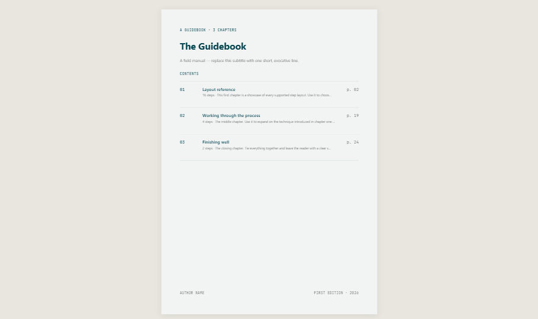
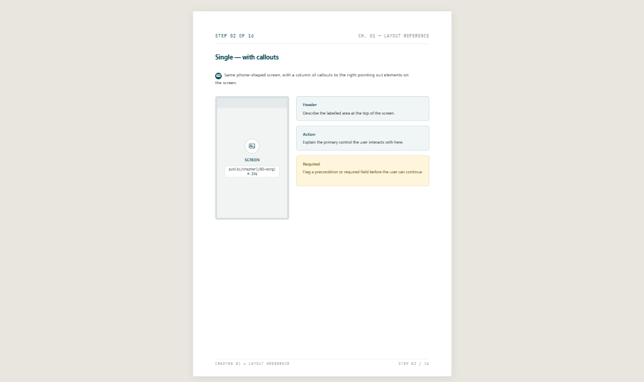
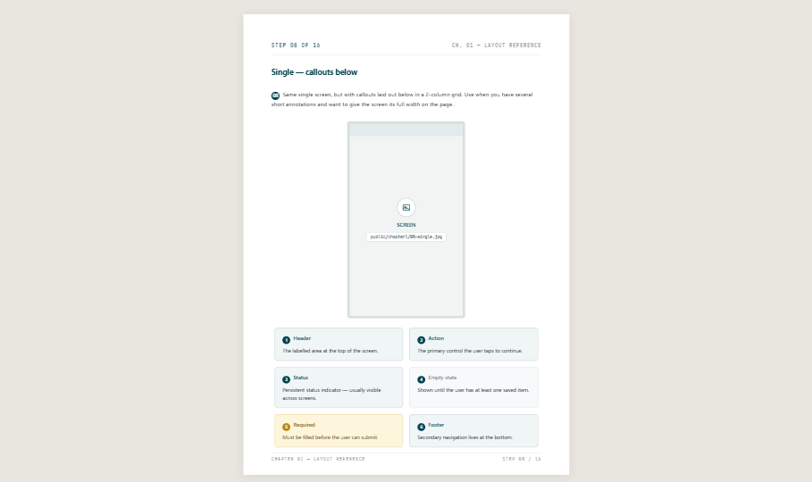
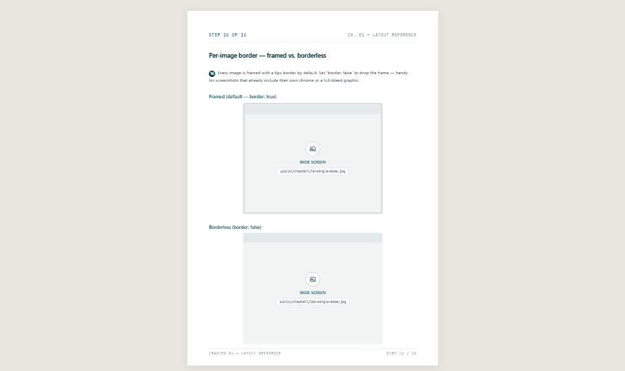

# Guided

A simple, minimalist, image-driven, print-ready guidebook editor (**guide** + **ed**itor).

Author image-driven guidebooks in a two-pane WYSIWYG editor — chapters, steps, and
screenshot layouts with callouts, annotations, watermarks, and pixel-accurate print/PDF
output. Pages are configurable (size (including custom dimensions) / orientation / margins / header / footer), and a step
can use the classic row layout or an opt-in **flexible grid** — drag dividers to resize rows and
columns, add/remove cells, fill each cell with images, callouts, and rich-text blocks (drag an image file straight onto a cell to upload it; drag a callout
off the stack to float it anywhere in the cell; align text left/center/right; give an image a border
that hugs the screenshot), and content auto-shrinks to fit, all within the page bounds.

## Demo

- **Demo video:** [`public/example/guided-pitch.mp4`](public/example/guided-pitch.mp4)
  (also embedded on the app's home page).
- **Live example:** open **`/demo`** in a running instance — a fully populated
  guidebook you can explore and edit. It doubles as the reference for every
  feature below; the in-app **`/quickstart`** guide walks through authoring
  your first project.

## Screenshots

Sample rendered A4 pages (each `.page` prints as one sheet):

| Cover &amp; contents | Side callouts |
| --- | --- |
|  |  |

| Callouts below | Per-image border |
| --- | --- |
|  |  |

## Stack

- Next.js 15 (App Router) · React 19 · TypeScript
- Tailwind CSS v4 · Zustand (editor state)
- Playwright (server-side PDF export — optional)

## Getting started

```bash
pnpm install
pnpm dev            # http://localhost:3000
```

The home page is the project picker. Open `/demo` for the populated example project (the
best way to learn the editor), or start a new project (each lives at its own `/<slug>` route).

### PDF export (optional)

Server-side PDF uses headless Chromium:

```bash
pnpm add -D playwright
npx playwright install chromium
```

Without it, the **Export PDF** button returns a 501; **Print** (browser print of `/<slug>/print`)
and **Download** (project zip) always work.

If the server doesn't listen on port 3000, set `PORT` or `PDF_BASE_URL` so the export can
reach its own print route (it deliberately ignores the request Host header).

### Deployment (Netlify)

`netlify.toml` is included. On Netlify, project storage automatically switches to Netlify
Blobs (see `docs/adr/ADR-008-pluggable-storage-driver-netlify-blobs.md`) and projects keep
the ~1-hour idle TTL. Server-side PDF export is unavailable there (501) — use browser
print-to-PDF on `/<slug>/print`.

## Scripts

```bash
pnpm dev            # dev server (turbopack)
pnpm build          # production build
pnpm start          # serve the production build
pnpm lint           # eslint
pnpm typecheck      # tsc --noEmit
pnpm test           # vitest
pnpm e2e            # playwright
```

## Features

- Two-pane editor: controls on the left, live A4 preview on the right (auto-fit so pages
  never overflow).
- Rich step layouts: single / double / wide image rows, per-image borders (color, width,
  radius, shadow), spacing control.
- Callouts: info / note / success / warning / danger with icons, side or below placement
  (mixable per row), column span / width.
- Markdown-subset rich text (bold, italic, headings, strikethrough, lists) in instructions,
  descriptions, callouts, and grid-cell text blocks.
- Annotation canvas: boxes, lines, square brackets, and connectors with snapping, waypoints,
  endpoint styles (arrow / circle / point / bar), straight or rectangular routing, adjustable
  fill opacity, z-order (bring forward / send backward), and draggable multi-line text labels.
- Per-section fonts, page background image, watermark, and a customizable ending page. The
  cover, chapter-intro, and back-cover pages each take their own background and text color,
  and a chapter can carry a placeable, resizable cover image.
- Multi-project hosting with ~1-hour ephemeral storage, project download (zip), and PDF export.

## Project layout

```
app/                 # routes: landing, /<slug> editor, /<slug>/print, /api/*, legal pages
components/renderer/  # the A4 renderer (pages, rows, callouts, annotations)
components/editor/     # the two-pane editor UI
lib/                  # schema, mutations, store, renderer + annotation helpers, project store
docs/adr/             # architecture decision records (MADR)
CHANGELOG.md          # released changes
ROADMAP.md            # upcoming features
```

## Data & privacy

Projects are stored ephemerally on the server under `data/` (gitignored) and removed about an
hour after inactivity. Only user-entered content and uploaded images are stored; no personal
details are collected. See `/privacy` and `/terms`.
