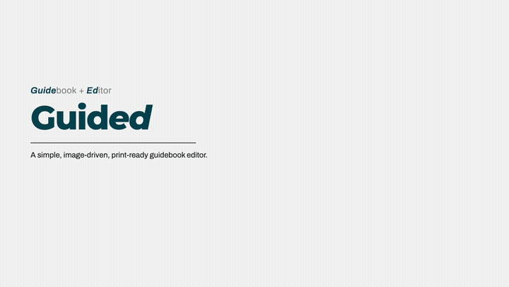

<div align="center">

# Guided

**An image-driven, print-ready guidebook editor.**
*Focus on the content. Guided handles the formatting.*

[](LICENSE)
[](CHANGELOG.md)
[](https://nextjs.org)
[](https://guide-editor.netlify.app)

**[Try it live](https://guide-editor.netlify.app)** · **[Explore the demo project](https://guide-editor.netlify.app/demo)** · **[Watch the walkthrough](docs/guided-pitch.mp4)**



</div>

---

Ever written a step-by-step guide in a word processor and spent more time fighting
layout than writing? Guided (**guide** + **ed**itor) exists so you don't have to.
You drop in screenshots, write the steps, and get back clean A4 pages that print
exactly as previewed, every time.

It is built for teams who ship documentation on a product's release cadence:
trainers, support and enablement, technical writers, anyone whose screenshot guides
go stale faster than they can rebuild them.

The screen is split in two: your controls on the left, a live page preview on the
right. Each step is a page built on a flexible grid. Drag the dividers, drop an
image straight onto a cell, float a callout wherever it reads best, and draw
annotations right on the page. If content gets crowded, it shrinks to fit rather
than spilling off the sheet.

The best introduction is the [demo project](https://guide-editor.netlify.app/demo):
a fully populated guidebook you can poke at and edit. The in-app
[quickstart](https://guide-editor.netlify.app/quickstart) walks you through your
first project.

## Why Guided

Most screen-capture tools produce web-only walkthroughs hosted on someone else's
platform. Guided is the opposite of that:

- **Print-first.** A4, Letter, A5, Legal or custom dimensions, laid out to the
  millimetre. The preview and the printed sheet are the same thing.
- **Yours to run.** MIT licensed, self-hostable, no accounts. Internal product
  screenshots never leave infrastructure you control.
- **Nothing retained.** No analytics, no tracking, and projects clean themselves
  up about 24 hours after your last edit. Download what you want to keep.

## Screenshots

Sample rendered A4 pages (each `.page` prints as one sheet):

| Cover & contents | Side callouts |
| --- | --- |
|  |  |

| Callouts below | Per-image border |
| --- | --- |
|  |  |

## What you get

- **Flexible page grid.** Resize rows and columns by dragging, fill cells with
  images, callouts, and rich-text blocks. Per-image crop/fit modes and borders
  that hug the screenshot.
- **Callouts.** Info, note, success, warning and danger, stacked in a cell or
  floated anywhere inside it.
- **Annotation canvas.** Boxes, ellipses, brackets, text, and elbow connectors
  with snapping, draggable bends, and double-click labels. What you draw is what
  prints.
- **Rich text.** A small markdown subset (bold, italic, strikethrough, headings,
  lists) in instructions, callouts, and text blocks.
- **Page control.** Orientation, margins, header and footer, per-section fonts,
  background images with matching text color, watermarks.
- **Projects that travel.** Download any project as a .zip and import it later.
  Export a print-accurate PDF, or use the browser's print dialog on the
  chrome-free `/print` view.

## Running it yourself

```bash
pnpm install
pnpm dev            # http://localhost:3000
```

The home page is the project picker. Open `/demo` for the populated example, or
start a new project. Each lives at its own `/<slug>` route.

### PDF export (optional)

Server-side PDF uses headless Chromium:

```bash
pnpm add -D playwright
npx playwright install chromium
```

Without it the **Export PDF** button returns a 501. **Print** (browser print of
`/<slug>/print`) and **Download** (project zip) always work. If the server isn't
on port 3000, set `PORT` or `PDF_BASE_URL` so the export can reach its own print
route. It deliberately ignores the request Host header.

### Deploying to Netlify

`netlify.toml` is included. On Netlify, storage switches automatically to Netlify
Blobs (see [ADR-008](docs/adr/ADR-008-pluggable-storage-driver-netlify-blobs.md)).
Set the site env var `GUIDED_STORAGE=blobs`. Server-side PDF export isn't available
on serverless functions (501); browser print-to-PDF covers it.

## Under the hood

Next.js 15 (App Router) · React 19 · TypeScript · Tailwind CSS v4 · Zustand.

No database, no accounts. A typed `Book` JSON document is the single source of
truth, a config-driven renderer turns it into millimetre-accurate pages, and
HTML/PDF are derived output only.

Architecture decisions are recorded as [ADRs](docs/adr/) in MADR format.


## Data & privacy

Only the content you create is stored, meaning your text and uploaded images, and
it's removed about an hour after inactivity (or immediately, if you delete the
project). See [/privacy](https://guide-editor.netlify.app/privacy) and
[/terms](https://guide-editor.netlify.app/terms).

## License

[MIT](LICENSE) · Font and dependency attributions in
[THIRD-PARTY-NOTICES.md](THIRD-PARTY-NOTICES.md).
